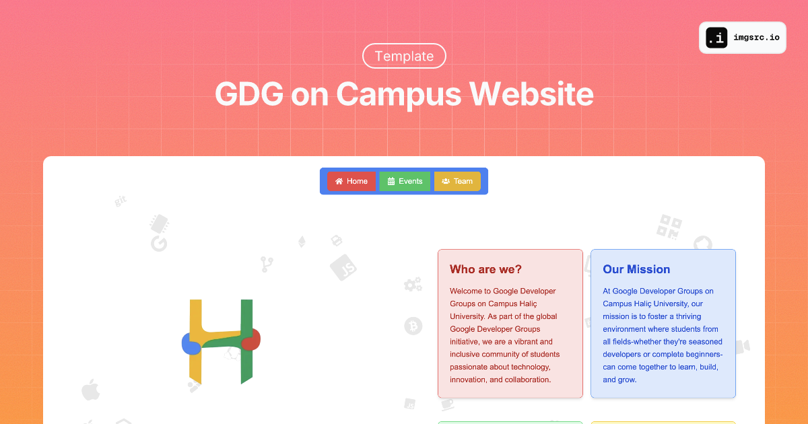

# Google Developer Groups on Campus Website Template

#### Created by [Furkan Ünsalan](https://github.com/furkanunsalan)

## Contents

1. [Introduction](#introduction)
2. [Requirements](#requirements)
3. [Usage](#usage)
   - [Data Folder](#data-folder)
   - [Image Folder](#image-folder)
4. [Hosting](#hosting)
5. [Contributing](#contributing)

## Introduction

This repository contains a website template for Google Developer Groups (GDG) on campus. It provides a customizable framework for showcasing your GDG events, team members, and social media profiles.

## Requirements

This project is built using:
- Next.js (created with create-next-app)
- TypeScript
- shadcn/ui

## Usage

### Data Folder

Modify the files in the `src/data/` folder to customize your website content:

```
src/
└── data/
    ├── events.ts
    ├── socials.ts
    ├── team.ts
    └── video.ts
```

#### events.ts

Contains an array of events with the following type definition:

```typescript
export interface Event {
  bannerImage: StaticImageData;
  images: StaticImageData[];
  title: string;
  slug: string;
  description: string;
  text: string;
  date: string;
  location: string;
}
```

#### socials.ts

Exports some constants named `socials`, `campus` and `joinLink` for the information of your club.

- `socials` constant exports your social media links like the following:

```typescript
socials.instagram.url
socials.linkedin.url
socials.github.url
socials.discord.url
```

- `campus` exports a string with the name of your campus to use on footer and in-between pages.

- `joinLink` exports a string which contains a link for your member application form etc.

#### team.ts

Contains an array of team members with the `TeamMember` type definition:

```typescript
export type Variant = 'green' | 'blue' | 'red' | 'yellow';
export interface TeamMember {
  avatar?: StaticImageData;
  name: string;
  surname: string;
  title: string;
  variant: Variant;
  linkedinUrl?: string;
  instagramUsername?: string;
}
```

#### video.ts

Contains an array of youtube videos with the `Video` type definition:

```typescript
export interface Video {
  url: string;
  title: string;
}
```

### Image Folder

Organize your images in the `src/images/` folder:

```
src/
└── images/
    ├── events/
    │   ├── event-1/
    │   │   ├── 1.jpeg
    │   │   ├── 2.jpeg
    │   │   └── ...
    │   ├── event-2/
    │   │   ├── 1.jpeg
    │   │   ├── 2.jpeg
    │   │   └── ...
    │   └── ...
    └── team/
        ├── member-1.jpeg
        ├── member-2.jpeg
        └── ...
```

- The `events` folder contains individual event folders with event images.
- The `team` folder contains images of your core team members.

**Note:** Currently, you need to manually import each image in `events.ts` and `team.ts`. This process will be improved in a future version to be more dynamic.

## Hosting

After forking this repository and customizing it to fit your needs, you can host the website on [Vercel](https://vercel.com/docs) for easy deployment and management.

## Contributing

We welcome contributions to improve this Google Developer Groups on Campus Website Template! Whether you're fixing bugs, adding new features, or improving documentation, your help is appreciated. Here's how you can contribute:

### Getting Started

1. Fork the repository on GitHub
2. Clone your fork locally:
   ```
   git clone https://github.com/gdg-on-campus-halic/gdg-campus-halic-web.git
   ```
3. Create a new branch for your feature or bug fix:
   ```
   git checkout -b feature/your-feature-name
   ```
   or
   ```
   git checkout -b fix/your-bug-fix
   ```

### Making Changes

4. Make your changes in your feature branch
5. Test your changes thoroughly
6. Add and commit your changes:
   ```
   git add .
   git commit -m "Your descriptive commit message"
   ```

### Commit Message Guidelines

- Use the present tense ("Add feature" not "Added feature")
- Use the imperative mood ("Move cursor to..." not "Moves cursor to...")
- Limit the first line to 72 characters or less
- Reference issues and pull requests liberally after the first line
- Consider starting the commit message with an applicable prefix:
  - `feat:` for new features
  - `fix:` for bug fixes
  - `docs:` for documentation changes
  - `style:` for changes that do not affect the meaning of the code
  - `refactor:` for code changes that neither fix a bug nor add a feature
  - `perf:` for code changes that improve performance
  - `test:` for adding missing tests or correcting existing tests

### Submitting Changes

7. Push your changes to your fork on GitHub:
   ```
   git push origin feature/your-feature-name
   ```
8. Create a pull request from your fork to the main repository
9. In the pull request description, clearly describe the changes and their purpose
10. Link any relevant issues in the pull request description

### Code Review Process

- The project maintainers will review your pull request
- They may suggest changes or improvements
- Make any requested changes by adding new commits to your branch
- Once approved, your pull request will be merged into the main branch

### Additional Guidelines

- Please ensure your code follows the existing style and includes appropriate documentation
- For major changes, please open an issue first to discuss the proposed changes
- Update the README.md with details of changes to the interface, if applicable
- Increase the version numbers in any examples files and the README.md to the new version that this Pull Request would represent

Thank you for interest in the Google Developer Groups on Campus Website Template!
